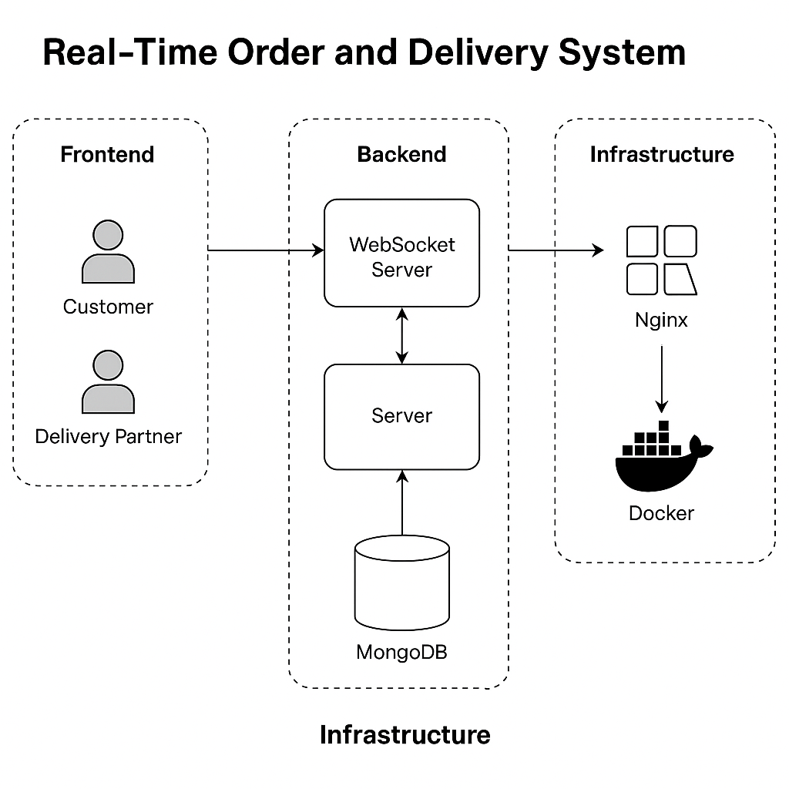

# 🛒 Real-Time Order and Delivery System

A full-stack real-time application for placing and tracking customer orders, assigning delivery partners, and managing statuses via WebSockets. Built using modern tech and deployed on an Ubuntu-based cloud VM using Docker, Nginx, and custom domains.



---

## 📦 1. Project Overview

This system facilitates:

- Customers placing orders via the frontend.
- Admins assigning delivery partners to orders.
- Real-time status updates for order tracking.
- WebSocket-based live communication between server, customers, and delivery partners.

---

## ⚙️ 3. Stack Used

**Frontend**
- React + TypeScript
- Zustand (State management)
- WebSocket Client
- TailwindCSS
- ShadCN (UI Components)

**Backend**
- Node.js + Express
- WebSocket server using `ws` package
- MongoDB (with Docker container)

**Infrastructure**
- Docker & Docker Compose
- Nginx (for reverse proxy and SSL)
- Ubuntu 22.04 (Cloud VM)
- GitHub (version control)

---

## 📁 4. Folder Structure
real-time-order-and-delivery-system/
│
├── client/ # React frontend
│ ├── src/
│ │ ├── components/ # UI components
│ │ ├── pages/ # Landing, Login, Register, Dashboard
│ │ └── hooks/ # tanstack/query, auth, customer, partner, admin
│ │ └── store/ # Zustand store, slices
│ │ └── lib/ # Config, API instance, wsClient, zod
│ │ └── types/ # Product, Order, User, etc.
│
├── server/ # Express backend
│ ├── prisma/ # Prisma schema
│ ├── src/
│ │ ├── routes/ 
│ │ ├── controllers/ 
│ │ ├── lib/ # Prisma client 
│ │ ├── utils/ # Api response 
│ │ ├── socket.ts # WebSocket server logic
│ │ └── server.ts # entrypoint
│ │ └── .env # (not committed) Required environment variables
│
├── mongo/ # MongoDB volume mount
├── prod.docker-compose.yml
├── dev.docker-compose.yml


### 🔐 SSH into your Cloud VM

```bash
ssh ubuntu@ubuntu.publicip.address

git clone https://github.com/pr4th4meshh/real-time-order-and-delivery-system.git
cd real-time-order-and-delivery-system
```

### Add env inside server/.env
PORT=5000
MONGO_URI=mongodb://mongo:27017/ordersystem
JWT_SECRET=yourjwtsecret
NODE_ENV=production


### run docker
docker-compose -f prod.docker-compose.yml up --env-file ./server/.env --build -d

### To update after code changes (to be automated later):
git pull
docker-compose -f prod.docker-compose.yml up --env-file ./server/.env --build -d

### To clean up unused containers and volumes:
docker system prune -a --volumes


### 🚀 Hosting & Deployment Steps
Add A record for orders.yourdomain.com pointing to your server IP.

Enable Full SSL using Nginx Reverse Proxy.


```
server {
    listen 80;
    server_name orders.yourdomain.com;

    location / { # server and client
        proxy_pass http://localhost:3000; (client, do somewhat similar for server)
        proxy_http_version 1.1;
        proxy_set_header Upgrade $http_upgrade;
        proxy_set_header Connection 'upgrade';
        proxy_set_header Host $host;
        proxy_cache_bypass $http_upgrade;
    }
}

```

### Restart Nginx
```
sudo systemctl restart nginx
```

### 🔌 WebSocket Flow
🔄 Real-Time Communication Logic:
On login, customers and delivery partners establish a WebSocket connection.

Backend maps userId to each WebSocket connection.

When an admin assigns a delivery partner, the server emits:

🔔 Status updates to the customer

🚚 Assignment info to the partner

Both users receive real-time updates without refreshing the page.

## 🧾 License

This project is licensed under a [Creative Commons Attribution-NonCommercial 4.0 International License](https://creativecommons.org/licenses/by-nc/4.0/).  
You **may not** use this project or any part of it for commercial purposes without explicit permission from the author.
